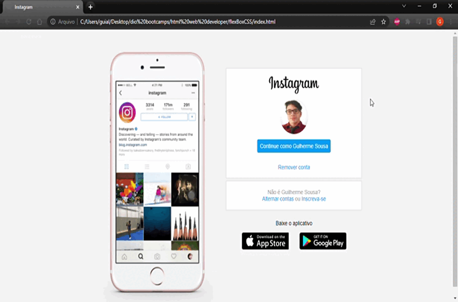

## Olá! :sunglasses:
 

Esse é o repositório da aula de **Flexbox** com o exercício de recriação da interface do *Instagram* com responsividade para mobile, utilizando **HTML** e **CSS**, feito no bootcamp [HTML Web Developer](https://www.dio.me/bootcamp/html-web-developer?ref=aegea) da **_Digital Innovation One_**.  

 

  

#
